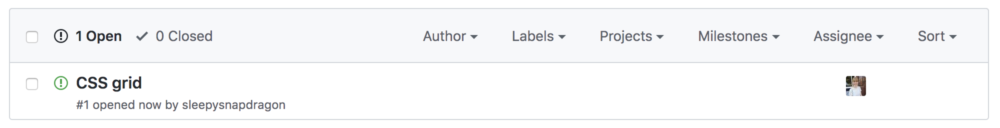

# skillswap

A place for FAC18 to create issues for topics they'd like to learn more about.  Assign yourself to a topic if you'd like to do a short (optional) workshop about it!  NB you can both suggest and assign yourself to a topic.

Whoever picks up the issue should figure out when a good time would be for whoever's interested to attend (maybe Slack poll?)

E.g.

I decide I want to learn about Grid, and I also decide to take it upon myself to research that and give the workshop myself
